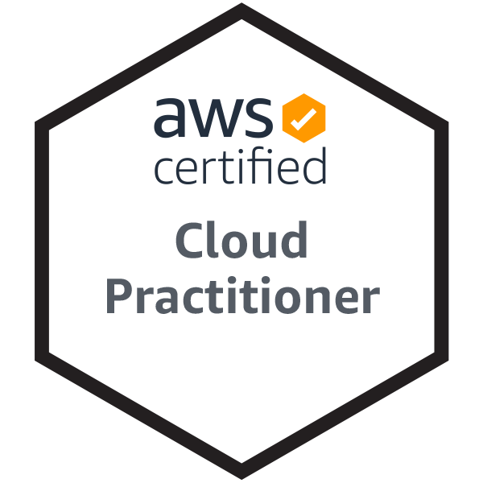

## Hi there 👋

My name is Matthew McCall, I am currently a C++ developer working on game engines!

### Docs
- Silicon Engine: https://mxtt-mmxix.github.io/silicon/html

### Self Promos
- Website: https://mmccall.dev
- LinkedIn: https://linkedin.com/in/96d9
- Instagram: [@__mmccall](https://instagram.com/__mmccall)
- Twitter: [@__mmccall](https://twitter.com/__mccall)
- Twitch: [mmapptv](https://twitch.tv/mmapptv)
- YouTube: [Matthew McCall](https://www.youtube.com/channel/UCW_31sZAGpg8DTO_aM09oeQ)
- GitLab: [mmapp](https://gitlab.com/_mmapp)

### Certs

### For Fun 
- Preferred programming langauge: C++
- Favorite games: Minecraft and Tetris
- The '96d9' in my LinkedIn link is the first 4 letters of the SHA-1 checksum of my name: `echo Matthew McCall | shasum`.
- FRC 5599 BNCHS Sentinels
<!--
**mxtt-mmxix/mxtt-mmxix** is a ✨ _special_ ✨ repository because its `README.md` (this file) appears on your GitHub profile.

Here are some ideas to get you started:

- 🔭 I’m currently working on ...
- 🌱 I’m currently learning ...
- 👯 I’m looking to collaborate on ...
- 🤔 I’m looking for help with ...
- 💬 Ask me about ...
- 📫 How to reach me: ...
- 😄 Pronouns: ...
- ⚡ Fun fact: ...
-->
